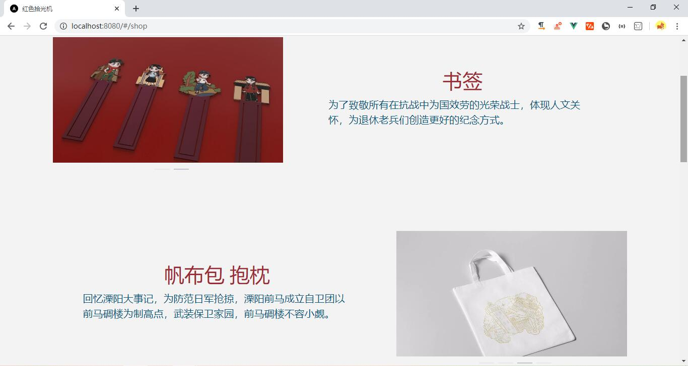
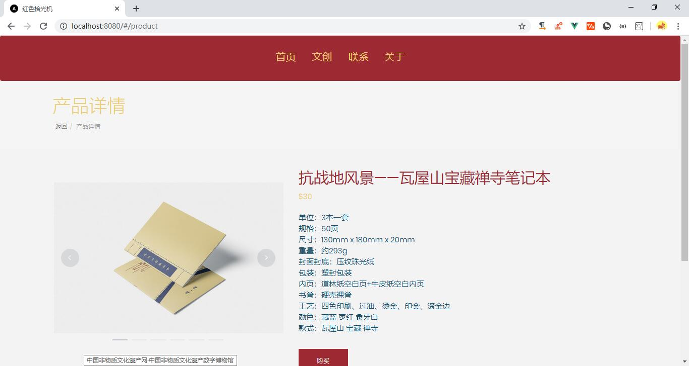
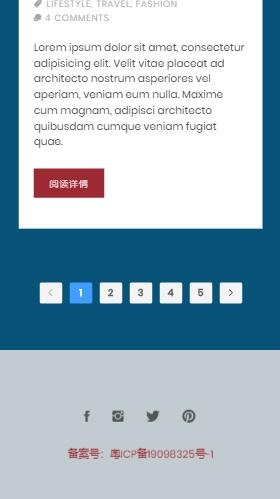
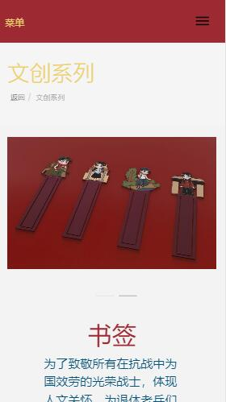

# pickup_light-vue

## Introduction

创青春项目——拾光机

## Technology Stack

- Vue: js框架
- Vue-Router: 路由管理
- Vuex: 状态管理
- Element-UI: UI组件库
- [BootCDN](https://www.bootcdn.cn/): CDN加速Vue、Vue-Router、Vuex等库，参考[Vue SPA 首屏加载优化实践](https://juejin.im/post/5a291092518825293b50366d)
- babel-plugin-component: [按需引入Element-UI](https://element.eleme.cn/#/zh-CN/component/quickstart)
- Bootstrap + jQuery: 原HTML模板遗留UI库
- themefisher-font: 原HTML模板遗留字体库

## Usage

Project setup:

```
npm install
```

Compiles and hot-reloads for development:

```
npm run serve
```

Compiles and minifies for production:

```
npm run build
```

Run tests:

```
npm run test
```

Lints and fixes files:

```
npm run lint
```

## Exhibition

### PC





### Mobile






## Format

### Git Commit

```bash
git commit -m "type: description"
```

- type:
  - feat：新功能（feature）
  - fix：修补bug
  - docs：文档（documentation）
  - style：格式（不影响代码运行的变动）
  - refactor：重构（即不是新增功能，也不是修改bug的代码变动）
  - test：增加测试
  - chore：构建过程或辅助工具的变动

- description: 详细描述
